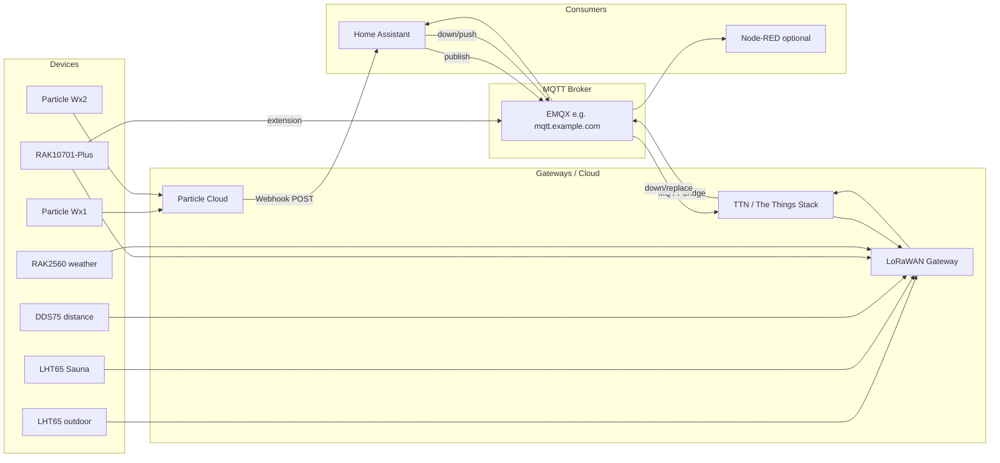

# Weather station & device stack: Particle, LoRaWAN, TTN, EMQX, Home Assistant

This document is for anyone who needs a single picture of the full weather-station and device setup: **Particle Boron** stations, **LoRaWAN/TTN** devices, **EMQX** as the local MQTT broker, **Home Assistant** for sensors and downlink, and the optional **Node-RED** pipeline that normalizes everything to a common format for Windy, display, or other consumers. You get an overview, data flows, a device reference, and how-to steps; deep dives (payload formatters, RAK10701 Field Tester, RAK2560 settings) stay in the linked docs.

---

## 1. High-level architecture

**Data flow in short:**

| Source | Path into system | HA / consumers |
|--------|------------------|----------------|
| **Particle Wx1/Wx2** | HTTP POST → HA webhook | Webhook updates `input_*` entities and publishes JSON to MQTT (e.g. `…/Bowman/wx1`, `…/NTwin/wx2`). Optional: Node-RED consumes MQTT and normalizes to flat format. |
| **TTN (LHT65, DDS75, RAK2560, etc.)** | Device → gateway → TTN → EMQX bridge → `v3/<your-app>@ttn/devices/+/up` | HA subscribes in `mqtt.yaml`; sensors from `decoded_payload`. Node-RED can subscribe same topic → `ttn-uplink-to-flat` → flat format → MQTT/Windy. |
| **RAK10701-Plus** | Device → gateway → TTN → EMQX rule republish to `…/rak10701-plus/up` | HA sensors on that topic; gateway Field Test extension also subscribes for downlink (EMQX rules forward down/replace to TTN). |
| **LoRaWAN downlink (e.g. Sauna LHT65)** | HA → `mqtt.publish` to `…/down/push` | EMQX rule → TTN connector → device. |

---

## 2. Device inventory (reference table)

Topic patterns below use placeholders: replace `<your-app>@ttn` with your TTN application ID and `<device_id>` with the device ID from TTN Console. Use a generic MQTT broker hostname (e.g. `mqtt.example.com`) in config examples.

| Device / group | Type | How it gets in | HA / Node-RED | Notes |
|----------------|------|----------------|---------------|--------|
| Particle Wx1 | Boron + weather | HTTP webhook → HA | `packages/particle_weather.yaml`, `input_number` / `input_datetime` / `input_text` | Device ID/name → Bowman/wx1; HA publishes to MQTT for Node-RED |
| Particle Wx2 | Boron + weather | HTTP webhook → HA | Same package | NTwin/wx2; MQTT publish |
| LHT65 (outdoor) | LoRaWAN | Gateway → TTN → EMQX | `mqtt.yaml` sensors on `v3/<your-app>@ttn/devices/<device_id>/up` | Temp, humidity, battery, RSSI/SNR |
| LHT65 (Sauna) | LoRaWAN | Same | `mqtt.yaml` + `sauna_lorawan_downlink` (interval 2 min / 30 min) | Downlink from HA when heater on/off |
| DDS75 distance sensor | LoRaWAN | TTN → EMQX | `mqtt.yaml` on `…/devices/<device_id>/up` | Distance (mm), battery, temp |
| RAK10701-Plus | LoRaWAN field tester | TTN → EMQX (rule to `…/rak10701-plus/up`) | `mqtt.yaml`; gateway extension for downlink | One-time activation downlink; EMQX rules for extension |
| RAK2560 + RK900-09 | LoRaWAN weather | TTN → EMQX | Optional HA sensors; Node-RED flat | Payload decoder type 187; see [RAK2560_weather_station_settings.md](../RAK2560_weather_station_settings.md) |
| FlameBoss S1 | Cloud MQTT | EMQX bridge from vendor | `mqtt.yaml` homeassistant/sensor/… | Same broker; out of scope for weather |

**TTN topic pattern:** `v3/<your-app>@ttn/devices/<device_id>/up` — use this in TTN Console, EMQX rules, and HA `state_topic`.

---

## 3. Particle path (end-to-end)

**Ingress:** Particle device publishes → Particle Cloud → Webhook (POST) to Home Assistant. Configure the webhook in HA (Settings → Automations & Scenes → Webhooks). The automation receives the body; `trigger.json.data` is parsed as `sensor_data`; device routing uses `device_name` or `device_id` (e.g. Wx1 vs Wx2).

**HA:** The Particle weather package (e.g. `packages/particle_weather.yaml`) contains the webhook trigger and one automation that:

- Updates `input_number.*`, `input_datetime.*`, `input_text.*` for Wx1 and Wx2 (temp, humidity, pressure, sea-level pressure, INA228 bus voltage/current/power/energy/temperature, lat/lon, battery voltage/SOC, last_update, published_at, firmware version, raw JSON snippet).
- Publishes `sensor_data` (JSON) to MQTT topics such as `…/environment/…/Bowman/wx1` and `…/NTwin/wx2` (no retain) for Node-RED or other consumers.

**Entity definitions:** Particle entities live in `input_number/weather-number.yaml`, `input_datetime/weather-datetime.yaml`, and `input_text/input-text.yaml` (Particle-related entries only). Do not copy credentials or webhook IDs into this doc; keep them in HA and `secrets.yaml` or env.

**Optional:** Node-RED can subscribe to those MQTT topics (or receive the webhook directly) and run `particle-webhook-to-flat.js` to produce the common flat format and feed Windy or a display pipeline.

---

## 4. TTN + EMQX path (uplink)

**Flow:** Device → LoRaWAN gateway (e.g. RAK7268V2) → **The Things Network** (e.g. `nam1.cloud.thethings.network`). TTN exposes MQTT; an **EMQX connector** subscribes to `v3/<your-app>@ttn/devices/+/up`. The rule **ttn_uplink** republishes messages to the same topic (and optionally `ttn/uplink`) on your MQTT broker so HA and Node-RED can subscribe locally. Use a placeholder for the broker hostname (e.g. `mqtt.example.com`) in any examples.

**EMQX config:** Connector, MQTT source, and rules live in your EMQX config (e.g. `conf.d/99-custom.hocon`). Do not put connector credentials, API keys, or passwords in this doc; say “credentials in EMQX config (not in this doc)”.

**HA:** In `mqtt.yaml`, MQTT sensors use `state_topic: "v3/<your-app>@ttn/devices/<device_id>/up"`. Value templates read from `value_json.uplink_message.decoded_payload.*` and `value_json.uplink_message.rx_metadata[0].rssi` / `snr`. Use `unique_id`, `device.identifiers`, and `name` for device registry.

**Payload formatters:** All decoders live under `lorawan/payload/`. See [PIPELINE-AND-NODE-RED.md](PIPELINE-AND-NODE-RED.md) “where to paste what”: RAK2560 → `rak-wx-station-default.js` (must include type 187); RAK10701 → `RAK rak10701-plus.js`; Dragino LHT65N, DDS75-LB, S31B-LS, etc. If you see “Unknown sensor type: 187” for RAK2560, the decoder is missing type 187 — use `rak-wx-station-default.js`.

---

## 5. Downlink (HA → device and RAK10701 extension)

**HA → TTN (e.g. Sauna LHT65):** A package such as `sauna_lorawan_downlink.yaml` defines automations: when the sauna climate entity is heating or off (for a short delay), HA publishes to `v3/<your-app>@ttn/devices/<device_id>/down/push` with TTN downlink JSON (e.g. f_port 2, base64-encoded payloads for 2 min vs 30 min uplink interval). An EMQX rule **ttn_downlink** forwards that topic to the TTN connector so the device receives the downlink in its RX window.

**RAK10701 Field Test:** The Field Test Data Processor extension on the RAK gateway subscribes to `v3/<your-app>@ttn/devices/rak10701-plus/up` on your MQTT broker (EMQX rule **ttn_uplink_rak10701** republishes TTN uplinks to that topic). The extension publishes downlinks to `…/rak10701-plus/down`. EMQX rules **rak10701_down** (republish to `…/down/replace`) and **ttn_downlink_replace** (forward to TTN) deliver the payload to the device. One-time activation: in TTN Console send FPort 10, hex `76312E312E30` (ASCII `v1.1.0`). Full gateway extension config and troubleshooting: [RAK10701-FIELD-TESTER.md](RAK10701-FIELD-TESTER.md).

---

## 6. Node-RED optional pipeline

**Purpose:** Normalize TTN and Particle into a **common flat format** so one downstream (Windy, display, InfluxDB) can consume either source.

**Files:**

- `ttn-uplink-to-flat.js` — TTN uplink JSON → flat object; sets `msg.topic` for MQTT out.
- `particle-webhook-to-flat.js` — Particle webhook body → same flat shape; path registry (e.g. Wx1 → Bowman/wx1, Wx2 → NTwin/wx2).
- `station.js` — Builds Windy.com observation URL from flat payload or HA state; two outputs (fresh / stale by age).
- `lorawanproc.json` — Sample flow: MQTT in on TTN uplink topic → extract & store last 20 per sensor → debug; optional 15-min “latest &lt;2h” branch.

**TTN device attributes:** In TTN Console set **mqttpath** (base path for topic) and **name** (display name; spaces removed for topic segment). Flat format includes Room, Floor, Location, Dev_Name, Temperature_C/F, Humidity, Pressure_hPa, battery_voltage_V, Wind_*, Distance_mm, `source` (ttn | particle), `mqtt_topic`, `extra`. Full schema and field aliases: [PIPELINE-AND-NODE-RED.md](PIPELINE-AND-NODE-RED.md).

**Where to paste:** Use the “where to paste what” table in [PIPELINE-AND-NODE-RED.md](PIPELINE-AND-NODE-RED.md) for payload formatters and Node-RED function nodes.

---

## 7. How-to / operations

**Adding a new TTN device**

1. Register the device in TTN Console.
2. Add or select an Application payload formatter (from `lorawan/payload/` as needed).
3. If using Node-RED flat format, set device attributes `mqttpath` and `name` in TTN.
4. In HA `mqtt.yaml`, add sensor entries with `state_topic: "v3/<your-app>@ttn/devices/<new_device_id>/up"` and value templates from `value_json.uplink_message.decoded_payload.*` and `rx_metadata[0].rssi`/`snr`.

**Adding a new Particle device**

1. In the Particle weather package, extend device routing by `device_id` or `device_name` and add a new branch that updates the same entity types (input_number, input_datetime, input_text) and calls `mqtt.publish` to a new topic.
2. Add the corresponding entities in `input_number/`, `input_datetime/`, and `input_text/`.
3. In `particle-webhook-to-flat.js`, extend the path registry (e.g. pathByDevice) for the new device name and MQTT path.

**RAK10701: no stats on device**

- Confirm the extension receives uplinks (EMQX rule **ttn_uplink_rak10701** republishing to `…/rak10701-plus/up`).
- Ensure the downlink topic is exactly `…/down` (not truncated).
- In TTN Console → Application → device → Downlink, check for queued/sent/failed downlinks.
- See [RAK10701-FIELD-TESTER.md](RAK10701-FIELD-TESTER.md) for full troubleshooting.

**Self-hosted TTN (optional)**  
The lorawan repo includes a Docker-based The Things Stack setup; see [README.md](../README.md) and `docker-compose.yaml`. This doc assumes TTN cloud; self-hosted is configured in that repo.

---

## 8. File and doc index

**Quick reference — where things live**

- **lorawan:** `payload/` (TTN payload formatters), `node-red/` (Function scripts + `lorawanproc.json`), `docs/` (this file, PIPELINE-AND-NODE-RED, RAK10701-FIELD-TESTER, RAK10703-TTN-SETUP), `RAK2560_weather_station_settings.md`, `docker-compose.yaml` for optional self-hosted TTS.
- **Home Assistant config (path on your server):** `packages/particle_weather.yaml`, `packages/sauna_lorawan_downlink.yaml`, `mqtt.yaml`, `input_number/weather-number.yaml`, `input_datetime/weather-datetime.yaml`, `input_text/input-text.yaml`.
- **EMQX config:** e.g. `conf.d/99-custom.hocon` (connectors, sources, rules — keep credentials out of this doc).

**Deep-dive docs**

- [PIPELINE-AND-NODE-RED.md](PIPELINE-AND-NODE-RED.md) — TTN payload formatters, common flat format, Node-RED functions, “where to paste what”, RAK10701 summary.
- [RAK10701-FIELD-TESTER.md](RAK10701-FIELD-TESTER.md) — Gateway extension config, EMQX rules, one-time activation, troubleshooting.
- [RAK2560_weather_station_settings.md](../RAK2560_weather_station_settings.md) — WisToolBox settings, LoRaWAN parameters, payload notes.
- [RAK10703-TTN-SETUP.md](RAK10703-TTN-SETUP.md) — RAK10703 Earthquake Sensor: TTN OTAA setup via AT commands, auto join, region, byte order.

---

## 9. Optional extras

**Windy:** `station.js` builds the Windy API observation URL; configure `stationId` and age threshold (e.g. 1 h) at the top. Output 1 = fresh, output 2 = stale.

**LoRaWAN dashboard in HA:** If you have a dashboard YAML (e.g. `dashboards/lorawan.yaml`), it is included via `configuration.yaml`; use it to view TTN device states and last update times.

**FlameBoss:** Same EMQX broker; a bridge connector subscribes to the vendor’s MQTT. Sensors appear under `homeassistant/sensor/…`. See `mqtt.yaml` and the EMQX config (e.g. FlameBossS1 connector) for structure; no credentials in this doc.
